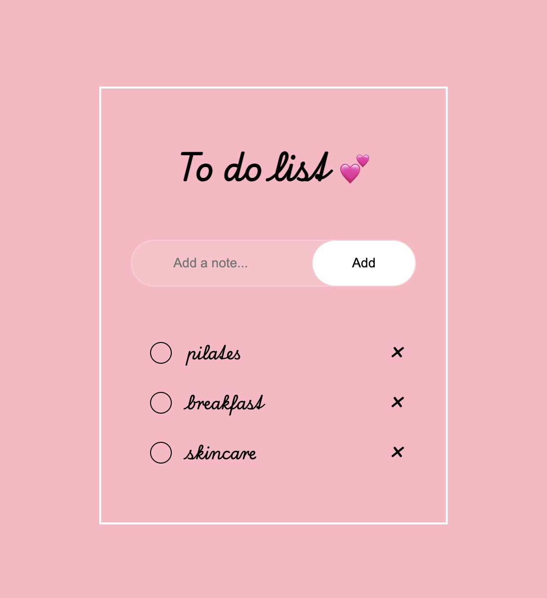

# To-Do List  
A simple task manager built with **HTML**, **SCSS**, and **JavaScript** — add, complete, and delete tasks with data saved locally.
# Introduction
This is a small web application that helps you organize your daily tasks.
You can **add**, **mark as completed**, or **delete tasks** — and everything is automatically saved in your browser’s localStorage, so your to-do list stays intact even after reloading the page.  
This project was created as a practice project to strengthen skills in front-end development, DOM manipulation, and SCSS styling.
# Screenshot  

  

  

# Installation for Users
You don’t need to install anything — the app is available online!  
**Visit the live site here:**  
https://tasya1711.github.io/To-do-list/
All tasks are saved automatically in your browser’s localStorage, so you can safely close or refresh the page without losing them.
# Installation for Developers
If you’d like to explore or improve the code locally:  

**Clone the repository:**  
git clone https://github.com/Tasya1711/To-do-list.git  
cd to-do-list  

**Install dependencies (if you’re using SCSS build tools):**  
npm install sass --save-dev  

**Start the SCSS watcher:**  
npm run watch:scss  

**Open index.html in your browser.**  
